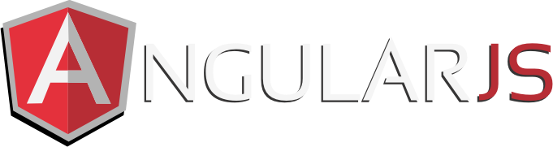

<h1 align="center">
  
</h1>

<h5 align="center">
  <code><a href="https://www.linkedin.com/in/vinicius-dionizio-6ab542217/" title="LinkedIn Profile"> LinkedIn</a></code>
</h5>
 

  Olá, sou Dionizio e estou aqui para falar um pouco sobre mim. Atualmente, estou cursando Ciência da Computação e estou no 7º ano de 8. Sou apaixonado por aprender tecnologia e inovação, e sou impulsionado a usar todo esse conhecimento para resolver problemas complexos e criar impactos positivos na vida das pessoas. Futuro Front-End
   
   
  🌱 Estou Cursando Ciência da Computação 7/8
   
  📫 Contate-me no email: vinipatrocinio.vd@gmail.com
   
  <a href="https://dionizioo.github.io/gallery/">Veja minha Galeria Projetos!!</a>

<h2 align="center">🔥 Languages & Frameworks & Tools & Abilities 🔥</h2>
 

  <code></code>
  <code></code>
  <code></code>
  <code></code>
  <code></code>
  <code></code>
  <code></code>
  <code></code>
  <code></code>
  <code></code>
  <code></code>
  <code></code>
  <code></code>
  <code></code>

<h2 align="center">⚡ Stats ⚡</h2>
 

  

    
  

  

    
  

   

<h2 align="center">👨‍💻 Repositories 👨‍💻</h2>
 

  
  

      

  
  

      

  
  

      

