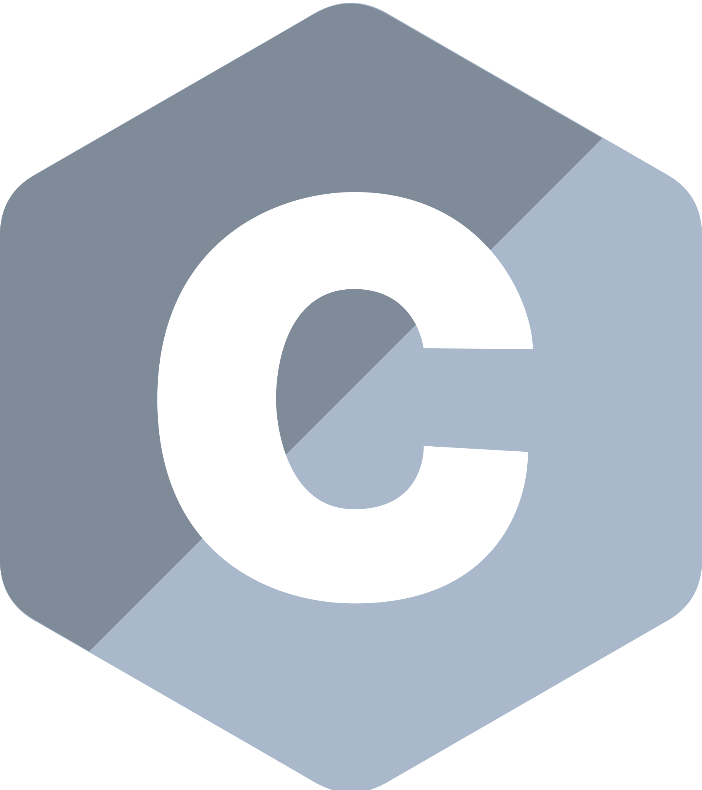
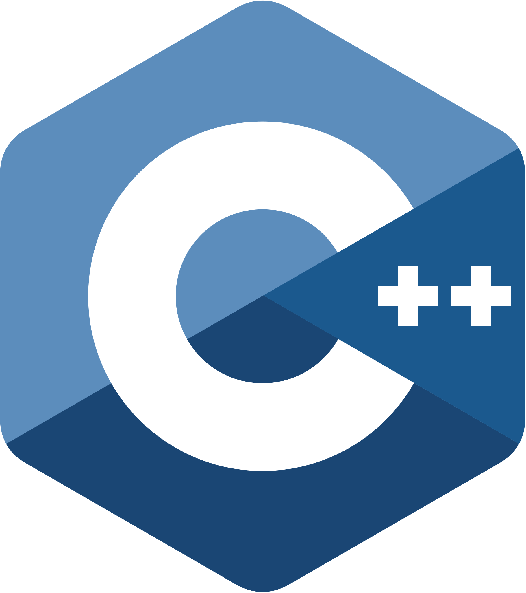
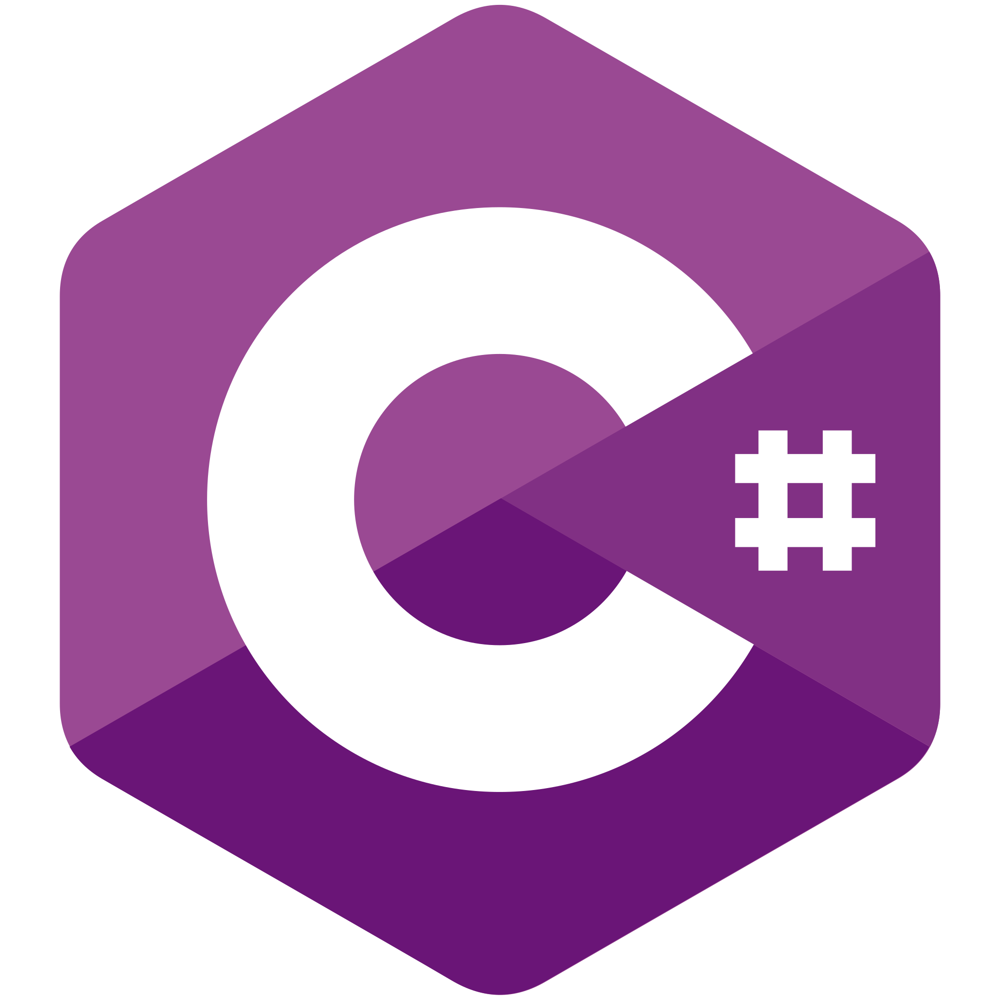
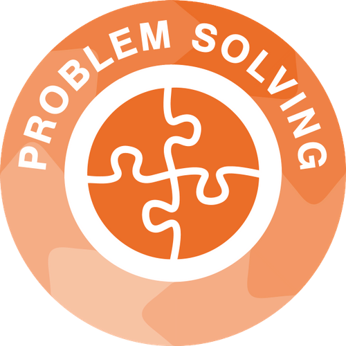
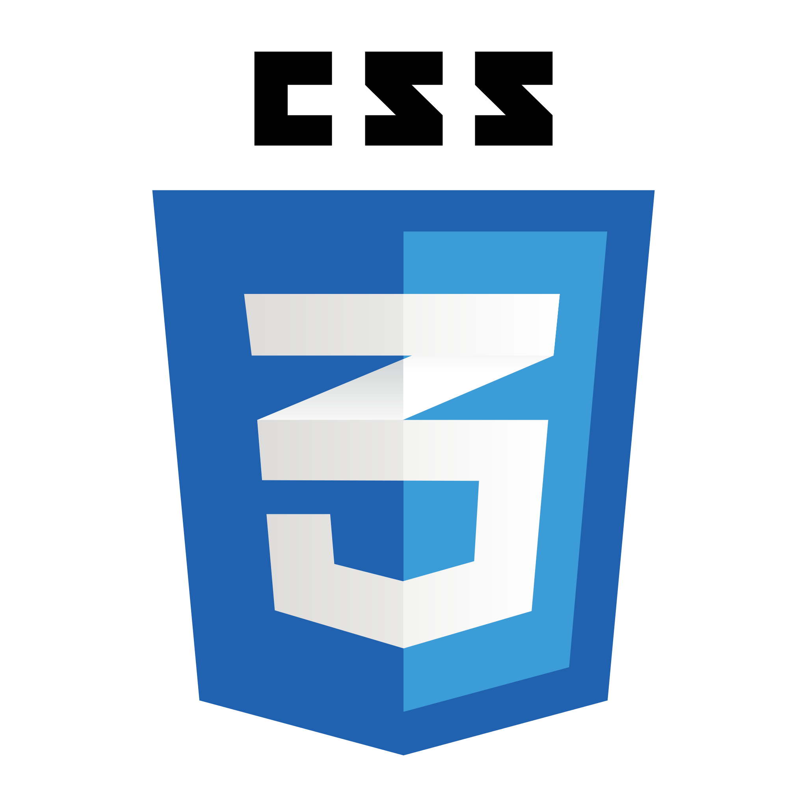
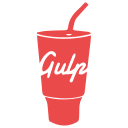
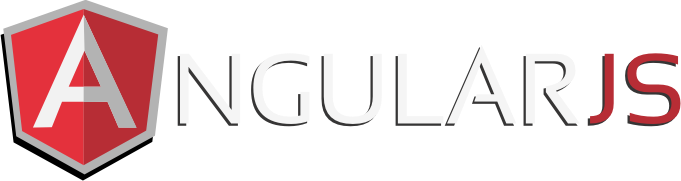
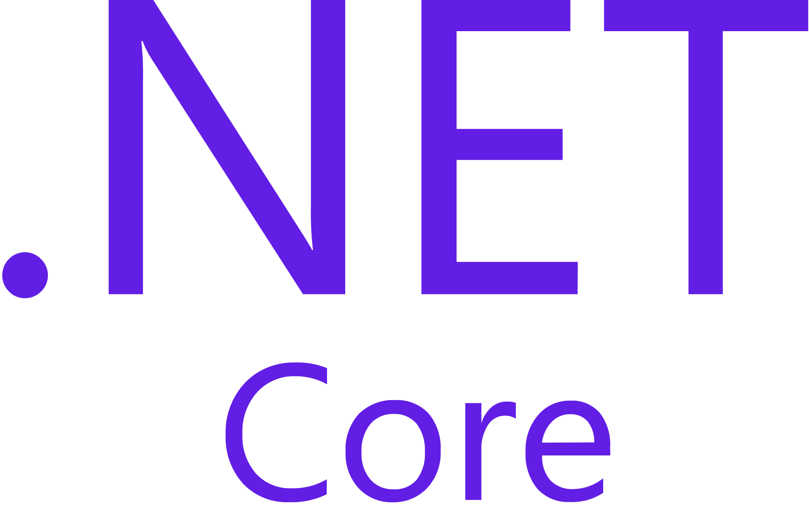
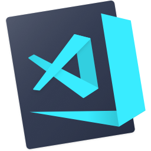
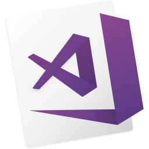

<h1 align="center">
  
</h1>

<h5 align="center">
  <code><a href="https://www.linkedin.com/in/osmandurdag/" title="LinkedIn Profile"> LinkedIn</a></code>
  <code><a href="https://www.hackerrank.com/zumrudu_anka" title="HackerRank Profile"> HackerRank</a></code>
  <code><a href="https://stackoverflow.com/users/12578260/osman-durdag" title="Stack Overflow Profile"> Stack Overflow</a></code>
  <code><a href="https://www.instagram.com/osman__durdag/" title="Instagram Profile"> Instagram</a></code>
</h5>
 

  Hi, I'm Osman DURDAĞ, Research Assistant & Computer Engineer & Software Developer from Turkey
   
   
  🔬 I'm currently studying for my doctorate at Atatürk University, Department of Computer Engineering
   
  🎓 I graduated from Atatürk University, Department of Computer Engineering (Master)
   
  🎓 I graduated from Black Sea Technical University, Department of Computer Engineering (Undergraduate)
   
  🎓 I graduated from Erzurum İbrahim Hakkı Science High School
   
  💻 I love writing code and learn anythings about it
   
  📚 I’m currently learning how to build E-Commerce Website with Django
   
  💬 Ask me anything about from <a href="https://github.com/zumrudu-anka/zumrudu-anka/issues" title="Issues">Here</a>
   
  📫 How to reach me: <a href="mailto: osmandurdag@hotmail.com">osmandurdag@hotmail.com</a>

<h2 align="center">🔥 Languages & Frameworks & Tools & Abilities 🔥</h2>
 

  <code></code>
  <code></code>
  <code></code>
  <code></code>
  <code></code>
  <code></code>
  <code></code>
  <code></code>
  <code></code>
  <code></code>
  <code></code>
  <code></code>
  <code></code>
  <code></code>
  <code></code>
  <code></code>
  <code></code>
  <code></code>
  <code></code>
  <code></code>
  <code></code>
  <code></code>
  <code></code>
  <code></code>
  <code></code>
  <code></code>
  <code></code>
  <code></code>
  <code></code>

<h2 align="center">⚡ Stats ⚡</h2>
 

  

    
    
  

           
  

    
  

   

  

<h2 align="center">👨‍💻 Repositories 👨‍💻</h2>
 

  

      

  
  

      

<h4 align="center">
  <a href="https://github.com/zumrudu-anka?tab=repositories" title="Show Repositories">🔎 Show More 🔍</a>
</h4>

<!--
**zumrudu-anka/zumrudu-anka** is a ✨ _special_ ✨ repository because its `README.md` (this file) appears on your GitHub profile.

Here are some ideas to get you started:

- 🔭 I’m currently working on ...
- 🌱 I’m currently learning ...
- 👯 I’m looking to collaborate on ...
- 🤔 I’m looking for help with ...
- 💬 Ask me about ...
- 📫 How to reach me: ...
- 😄 Pronouns: ...
- ⚡ Fun fact: ...

Notes: If you want use this readme, firstly star it please. If you can't align your repositories like this, please change your repository desription to shorter than now. Maybe 4 or 5 word will be good.

-->
